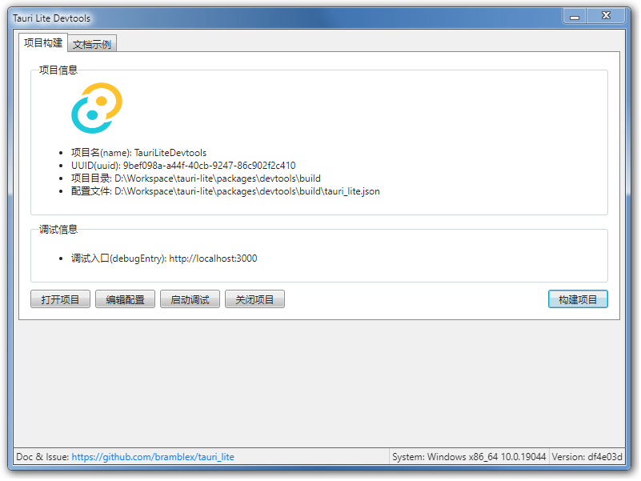
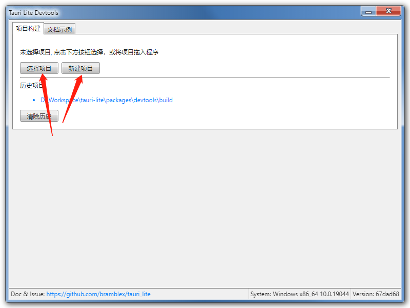
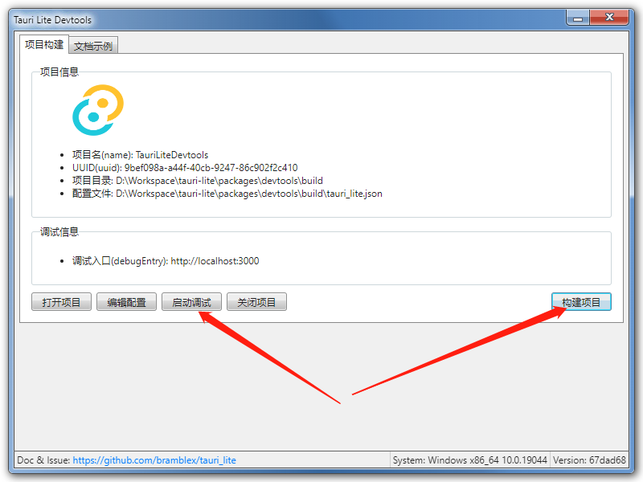
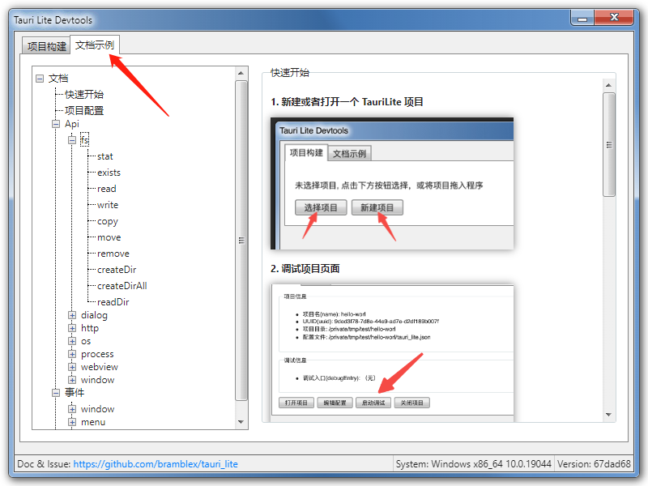
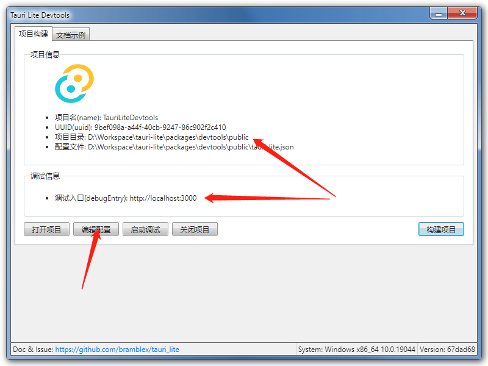
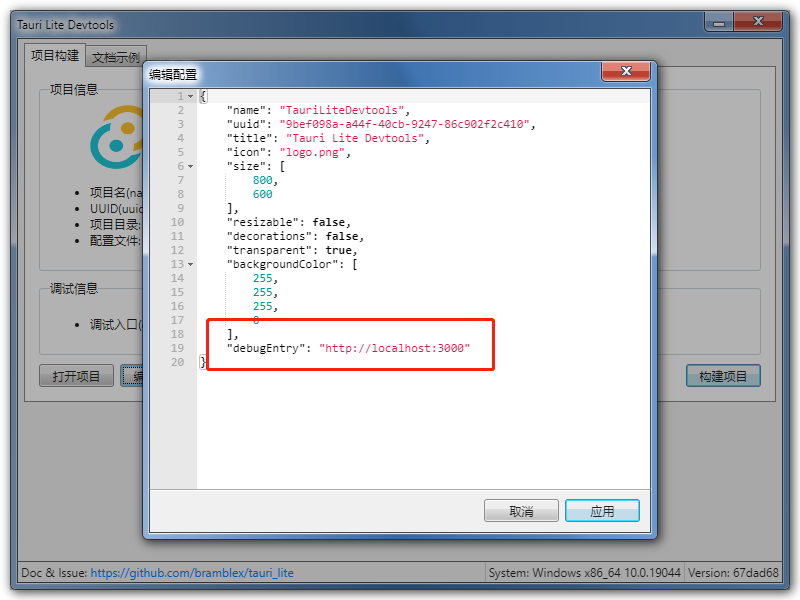

# Tauri Lite

一个基于 Tauri WRY 跨端 Webview 库的超轻量极易用的跨端应用开发框架。



（这个窗口只是看着像 Win7，但整个窗口都是用 html 和 css 绘制而成）

## 目标

- 超轻量
  - 可执行文件只有 3MB （Mac OS 3.3MB，Windows 2.5MB），zip 后只有 1MB 上下。
  - 不依赖 NodeJS 、Chromium 或 Webkit 等庞然大物，仅依赖系统原生 Webview。
- 极易用
  - 不需要学习 NodeJS、Electron 或者 Rust 等复杂的框架和技术，只需要最基本的前端技术即可开发出跨端桌面应用。
  - 不需要使用命令行。TauriLite 提供您图形化开发工具，调试构建只需要点一下按钮。
- 跨平台
  - 支持 MacOS 和 Windows，双端只需一套代码。

## TODO

- [x] 单窗口模式
- [x] 应用构建
  - [x] MacOS 构建
  - [x] Windows 构建
  - [ ] Windows APP Icon 和窗口 Icon 自定义
  - [ ] 构建是在可执行文件中加入 Meta 信息
- [x] API
  - [x] fs
  - [x] http
  - [x] dialog
  - [x] os
  - [x] process
  - [x] window
  - [x] webview
- [x] 开发者工具
  - [x] 调试窗口
  - [x] Api 文档与示例
  - [x] 项目配置编辑器
- [ ] 多窗口模式
  - [ ] 打开多窗口
  - [ ] 多窗口间通讯
- [ ] 全局快捷键
- [ ] 系统 Tray

## 快速开始

1. 在 [Release 页面](https://github.com/bramblex/tauri_lite/releases) 中下载对应系统的开发者工具(Devtools)。
2. 打开开发者工具(Devtools)，导入或者新建项目。如果有已经有的前端项目，可以通过「选择项目」index.html 文件所得目录。如果没有项目则可以直接通过「新建项目」新建一个 Tauri 项目。
   - 
3. 项目打开或者新建以后，会进入项目页面，可以直接通过启动调试打开 TauriLite 窗口，也可以点击构建将项目打包成一个可执行文件。
   - 
4. 在开发中如果遇到问题，可以直接在开发者工具(Devtools)中查看文档。
   - 
5. 如果你用的是 React 或者 Vue，可以使用项目的 public 文件夹作为项目根目录，并且通过配置 `debugEntry` 选项让 TauriLite 窗口用开发链接作为入口。
   - 
   - 

## 项目配置

### 基本选项

- name: 项目名
- uuid: 项目 UUID 由开发者工具(Devtools)自动生成，不建议修改。

### 调试选项

- debugEntry: 调试入口, vue / react 等项目调试时使用，如 http://localhost:3000

### 项目选项（仅构建时用）

- icon: 图标
- version: 版本
- author: 作者
- description: 描述
- copyright: 版权
- license: 许可证
- website: 网站

### 窗口选项

- entry: 入口文件, 不填则默认为 index.html
- backgroundColor: 背景颜色 RGBA, 例如 [255, 255, 255, 1]
- devtools: 是否启用开发者工具
- title: 窗口标题
- theme: 窗口主题
- size: 窗口大小, 不填则默认为 [800, 600]
- minSize: 窗口最小大小
- maxSize: 窗口最大大小
- position: 窗口位置
- resizable: 是否可调整窗口大小
- minimizable: 是否可最小化窗口
- maximizable: 是否可最大化窗口
- closable: 是否可关闭窗口
- fullscreen: 是否全屏显示
- maximized: 是否最大化窗口
- visible: 是否可见
- transparent: 是否透明
- decorations: 是否显示窗口装饰
- alwaysOnTop: 是否总在最前面
- alwaysOnBottom: 是否总在最后面
- visibleOnAllWorkspaces: 是否在所有工作区可见
- focused: 是否聚焦于窗口
- contentProtection: 是否启用内容保护
- menu: 窗口菜单选项, 详见下方

### 菜单选项

```ts
type MenuOptions = [string, number] | [string, MenuOptions] | "---";
```

例子：

```json
{
  "menu": [
    [
      "menu1",
      [["world", 123], "---", ["hello", 456], ["submenu", [["item", 789]]]],
      "menu2",
      []
    ]
  ]
}
```

## API

### fs

```ts
function stat(path: string): Promise<Stat>;
function exists(path: string): Promise<boolean>;
function read(path: string, encode?: "utf8" | "base64"): Promise<string>;
function write(
  path: string,
  content: string?,
  encode?: "utf8" | "base64"
): Promise<void>;
function copy(
  from: string,
  to: string,
  copyOptions?: CopyOptions
): Promise<void>;
function move(
  from: string,
  to: string,
  copyOptions?: CopyOptions
): Promise<void>;
function remove(path: string): Promise<void>;
function createDir(path: string): Promise<void>;
function createDirAll(path: string): Promise<void>;
function readDir(path: string): Promise<ReadDirItem[]>;

interface ReadDirItem {
  name: string;
  type: "file" | "dir";
}

interface Stat {
  isDir: boolean;
  isFile: boolean;
  isSymlink: boolean;
  size: number;
  modified: number;
  accessed: number;
  created: number;
}

interface CopyOptions {
  overwrite?: boolean;
  skipExist?: boolean;
  bufferSize?: number;
  copyInode?: boolean;
  contentOnly?: boolean;
  depth?: number;
}
```

### http

```ts
function request(options: RequestOptions): Promise<Response>;
function get(url: string, headers?: Headers): Promise<Response>;
function post(url: string, body: string, headers?: Headers): Promise<Response>;

interface Headers {
  [key: string]: string;
}

interface RequestOptions {
  method: string;
  url: string;
  headers?: Headers;
  body?: string;
}

interface Response {
  status: number;
  headers: Headers;
  body: string;
}
```

### dialog

```ts
function showMessage(
  title: string,
  message?: string,
  level?: "info" | "warning" | "error"
): Promise<void>;
function pickFile(extensions?: string[], startDir?: string): Promise<string>;
function pickFiles(extensions?: string[], startDir?: string): Promise<string[]>;
function pickDir(startDir?: string): Promise<string>;
function pickDirs(startDir?: string): Promise<string[]>;
function saveFile(extensions?: string[], startDir?: string): Promise<string>;
```

### os

```ts
function info(): Promise<OsInfo>;
function dirs(): Promise<Dirs>;
function sep(): Promise<string>;
function eol(): Promise<string>;

interface OsInfo {
  os: string;
  arch: string;
  version: string;
}

interface Dirs {
  work: string;
  temp: string;
  data: string;
  home: string;
  audio: string;
  desktop: string;
  document: string;
  download: string;
  font: string;
  picture: string;
  public: string;
  template: string;
  video: string;
}
```

### process

```ts
function pid(): Promise<number>;
function currentDir(): Promise<string>;
function currentExe(): Promise<string>;
function env(): Promise<Record<string, string>>;
function setCurrentDir(path: string): Promise<void>;
function exit(): Promise<void>;
function exec(
  cmd: string,
  args: string[],
  options: ExecOptions
): Promise<ExecResult>;
function open(uri: string): Promise<void>;
function version(): Promise<string>;

interface ExecOptions {
  env?: Record<string, string>;
  currentDir?: string;
  detached?: boolean;
}

interface ExecResult {
  status: number;
  stdout: string;
  stderr: string;
}
```

### webview

- isDevtoolsOpen
- openDevtools
- closeDevtools
- setBackgroundColor

### window

- scaleFactor
- innerPosition
- outerPosition
- setOuterPosition
- innerSize
- setInnerSize
- outerSize
- setMinInnerSize
- setMaxInnerSize
- setTitle
- title
- isVisible
- setVisible
- isFocused
- setFocus
- isResizable
- setResizable
- isMinimizable
- setMinimizable
- isMaximizable
- setMaximizable
- isClosable
- setClosable
- isMinimized
- setMinimized
- isMaximized
- setMaximized
- Decorated
- setDecorated
- fullscreen
- setFullscreen
- setAlwaysOnTop
- setAlwaysOnBottom
- requestUserAttention
- setContentProtection
- setVisibleOnAllWorkspaces
- setCursorIcon
- setCursorPosition
- setCursorGrab
- setCursorVisible
- dragWindow
- setIgnoreCursorEvents

## License

MIT
