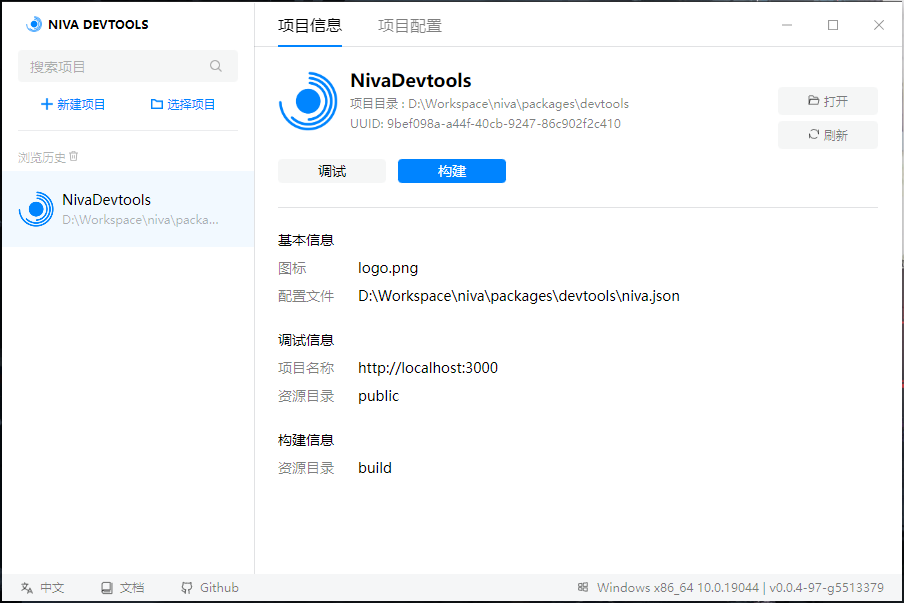

#  Niva

基于 Tauri WRY 跨端 Webview 库的超轻量极易用的跨端应用开发框架。

- 下载： [https://github.com/bramblex/niva/releases](https://github.com/bramblex/niva/releases)
- 文档： [https://bramblex.github.io/niva/docs/intro](https://bramblex.github.io/niva/docs/intro)
- 快速上手： [https://bramblex.github.io/niva/docs/tutorial/new-project](https://bramblex.github.io/niva/docs/tutorial/new-project)

## 目标

- 超轻量
  - 构建的桌面应用最小只有 3MB，仅有 Electron 的 1/10。
  - Niva 仅依赖系统原生的 Webview，不依赖 Chromium 或者 Node.js，极致的轻量。
- 极易用
  - 仅使用前端技术，不需要学习复杂的 Node.js 和 Electron API 也不需要复杂的配置，即可构建出一个桌面应用。
  - 构建单可执行文件，无需安装，点击即用。
- 图形化
  - Niva 提供图形化界面的开发工具，一键点击构建桌面应用，无需复杂的命令行操作，也无需安装 Node 环境。
- 跨平台
  - 同时支持 Windows、macOS，无需额外的配置，即可构建出跨平台的桌面应用。

## 亮点

### 极低的上手难度

简单项目（没有使用 webpack 等构建工具的简单签单项目），还是常见的 Vue 项目或者 React 项目，无需额外配置，一键拖入，一键构建。

### 灵活的功能

支持单窗口、多窗口、浮窗、窗口后台运行等多种场景。

### 丰富的配置

丰富的配置，窗口大小、窗口标题、窗口图标、窗口菜单、窗口是否可缩放、窗口是否可拖动、窗口是否可关闭、窗口是否可最大化、窗口是否可最小化等等都可以配置。全局快捷键、系统托盘图标等等也可以进行配置。详细选项文档 [选项文档](https://bramblex.github.io/niva/docs/options/project) 。

### 完善的 API

Niva 提供了丰富的 API, 如 clipboard, dialog, extra, fs, http, monitor, os, process, resource, shortcut, tray, webview, window, window_extra 等 API。详见 [API 文档](https://bramblex.github.io/niva/docs/api/niva)。

## Todo

- [ ] Niva 1.0

  - [ ] Niva API TypeScript 类型声明。
  - [ ] 应用程序签名
    - [ ] MacOS
    - [ ] Windows
  - [ ] 支持 Node.js 调用，作为 NodeJS 应用程序的 UI 窗口。
  - [ ] 支持系统通知 Notification。

- [ ] Niva 2.0
  - [ ] 对 Window10 低版本增加 [miniblink](https://github.com/weolar/miniblink49) 支持，解决低版本 Windows 对 Webview2 支持不完善的问题。

## Contributors

## License

MIT
