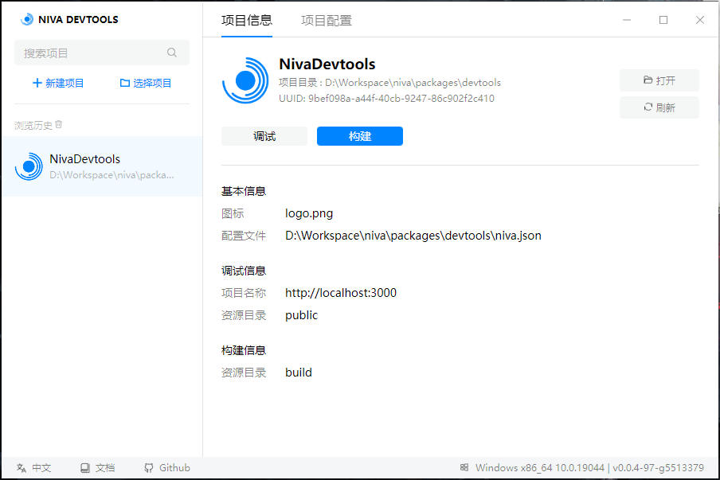

#  Niva

基于 Tauri WRY 跨端 Webview 库的超轻量极易用的跨端应用开发框架。



- 下载： [https://github.com/bramblex/niva/releases](https://github.com/bramblex/niva/releases)
- 文档： [https://bramblex.github.io/niva/docs/intro](https://bramblex.github.io/niva/docs/intro)
- 快速上手： [https://bramblex.github.io/niva/docs/tutorial/new-project](https://bramblex.github.io/niva/docs/tutorial/new-project)

当前候选为 **0.10.0-beta.1**，范围和逐平台验收状态见[候选验收记录](docs/release-0.10.0-beta.1.md)。本版提供现有`Niva`原生 API 和统一 TypeScript runtime；CommonJS 与 ESM Node 风格模块均可独立启用，并按现有模块实现能力，不承诺完整 Node.js 兼容。异步 API 的创建与控制统一走 IPC `api_call`；流式操作创建后可用稳定 IPC 数据通道，已就绪的 WebSocket 只作可选优化。IPC 二进制帧在传输边界使用 Base64。同步 XHR 仅用于需要同步返回的 Node 兼容 API。窗口/文件/进程能力及传输边界见[Bridge 合约](docs/bridge.md)。

## 从源码构建

页面运行时由`packages/runtime`中的TypeScript生成，需先构建再编译Native：

```sh
npm ci
npm run build --workspace=packages/runtime
cargo build --release -p niva -p niva-packager
npm run build --workspace=packages/devtools
```

修改运行时源码后需重新生成产物。Cargo编译不下载npm依赖；发行build kit包含编译好的主程序与统一打包器，使用kit打包业务应用不需要开发者安装Node或Rust。Windows单EXE/绿色ZIP与macOS app/ZIP使用同一个打包核心，详见[打包说明](docs/packager-usage.md)。

## 目标

本节描述产品方向，不替代当前候选范围或平台验收。完整 runtime 主程序体积硬门禁为 macOS 严格小于 3,300,000 bytes、Windows 严格小于 3,500,000 bytes；macOS 的 3,000,000 bytes 仅为参考目标。该口径不代表整个应用包或 build kit 的大小。

- 超轻量
  - Niva 使用系统 WebView，不随应用打包 Chromium 或 Node.js。
- 极易用
  - 仅使用前端技术，不需要学习复杂的 Node.js 和 Electron API 也不需要复杂的配置，即可构建出一个桌面应用。
  - Windows 可输出单 EXE；macOS 交付 `.app` 应用包，可另行打成 ZIP。
- 图形化
  - Niva 提供图形化界面的开发工具，一键点击构建桌面应用，无需复杂的命令行操作，也无需安装 Node 环境。
- 跨平台
  - 支持 Windows、macOS；具体支持范围和验收状态以候选记录为准。

## 亮点

### 极低的上手难度

简单项目（没有使用 webpack 等构建工具的简单签单项目），还是常见的 Vue 项目或者 React 项目，无需额外配置，一键拖入，一键构建。

### 灵活的功能

支持单窗口、多窗口、浮窗、窗口后台运行等多种场景。

### 丰富的配置

丰富的配置，窗口大小、窗口标题、窗口图标、窗口菜单、窗口是否可缩放、窗口是否可拖动、窗口是否可关闭、窗口是否可最大化、窗口是否可最小化等等都可以配置。全局快捷键、系统托盘图标等等也可以进行配置。详细选项文档 [选项文档](https://bramblex.github.io/niva/docs/options/project) 。

### 完善的 API

Niva 提供了丰富的 API, 如 clipboard, dialog, extra, fs, http, monitor, os, process, resource, shortcut, tray, webview, window, window_extra 等 API。详见 [API 文档](https://bramblex.github.io/niva/docs/api/niva)。

## 后续计划

0.10.0-beta.1 是候选版本，不代表 v1.0 验收通过。仍开放的门禁和证据边界见[路线图](docs/roadmap.md)与[候选验收记录](docs/release-0.10.0-beta.1.md)。

- [ ] Niva 1.0

  - [x] Niva API TypeScript 类型声明（从 `packages/runtime` 同源构建到 `@niva/types`；仍需持续与实现核对）。
  - [ ] 应用程序签名
    - [ ] MacOS
    - [ ] Windows
  - [ ] Node契约与真实项目验收（目标子集不等于完整Node运行时；stdio宿主使用主窗口普通process流，见[宿主说明](docs/stdio-host-design.md)）。
  - [ ] 支持系统通知 Notification。

- [ ] Niva 2.0
  - [ ] 低版本 Windows 的 [MiniBlink](https://github.com/weolar/miniblink49) 兼容方案（按用户决定暂缓，尚未实现）。

## Acknowledgments

[@wen-gang(晓港)](https://github.com/wen-gang)  - 感谢晓港帮 Niva 设计了新的 Logo

## Contributors


## License

MIT
